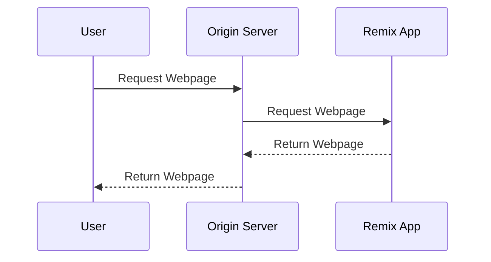
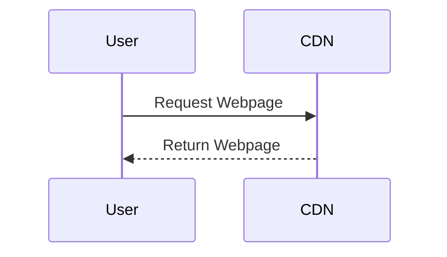

# TPL Barcode Generator

TPL Barcode Generator is a tool that generates phone wallpapers that double as digital Toronto Public Library cards. A digital version of your library card can be useful if you want to lighten your wallet or avoid forgetting your physical card.

This repository contains the code for a version of TPL Barcode Generator that was built using Remix and Flowbite React. I rebuilt this app using JavaScript in order to take advantage of Cloudflare's free static website hosting.

JavaScript Version (Recommended):<br>[tplbarcode.com](https://tplbarcode.com/)

Remix Version:<br>
[tpl-barcode.pages.dev](https://tpl-barcode.pages.dev/)

## Hosting on TPL Barcode Generator on Cloudflare Pages

### TPL Barcode Generator - Remix Version

<div style="text-align: center;">



</div>

Remix uses server-side rendering to build webpages before serving them to the client. This can be very useful in many circumstances, but is not necessary for a simple tool like TPL Barcode Generator.

### TPL Barcode Generator - JavaScript Version

<div style="text-align: center;">



</div>

In the JavaScript version of TPL Barcode Generator, all application logic is performed by the user's browser. This allows the app to be hosted for free on Cloudflare Pages.

## Original Remix + Cloudflare README Information...

- 📖 [Remix docs](https://remix.run/docs)
- 📖 [Remix Cloudflare docs](https://remix.run/guides/vite#cloudflare)

## Development

Run the dev server:

```sh
npm run dev
```

To run Wrangler:

```sh
npm run build
npm run start
```

## Typegen

Generate types for your Cloudflare bindings in `wrangler.toml`:

```sh
npm run typegen
```

You will need to rerun typegen whenever you make changes to `wrangler.toml`.

## Deployment

First, build your app for production:

```sh
npm run build
```

Then, deploy your app to Cloudflare Pages:

```sh
npm run deploy
```

## Styling

This template comes with [Tailwind CSS](https://tailwindcss.com/) already configured for a simple default starting experience. You can use whatever css framework you prefer. See the [Vite docs on css](https://vitejs.dev/guide/features.html#css) for more information.
